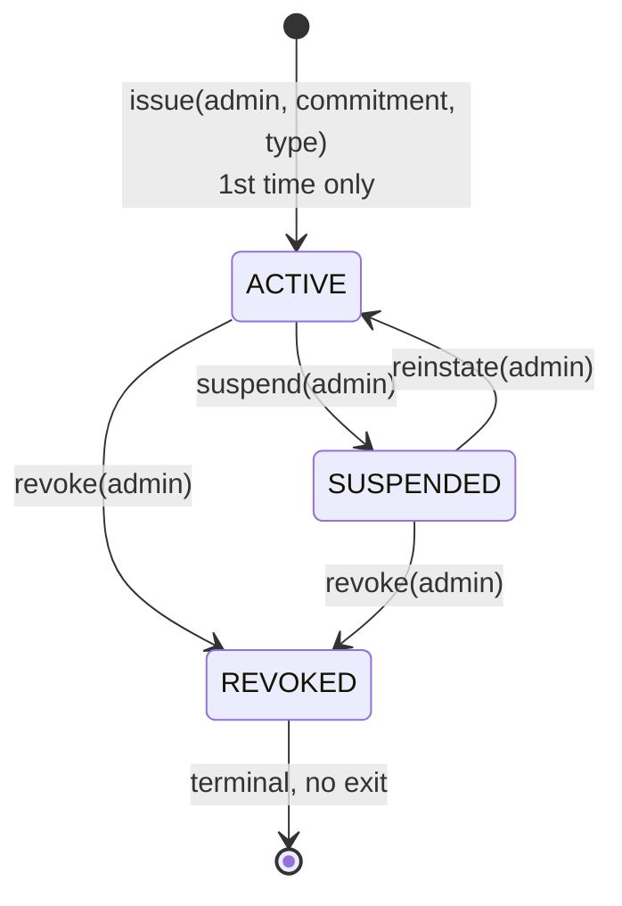
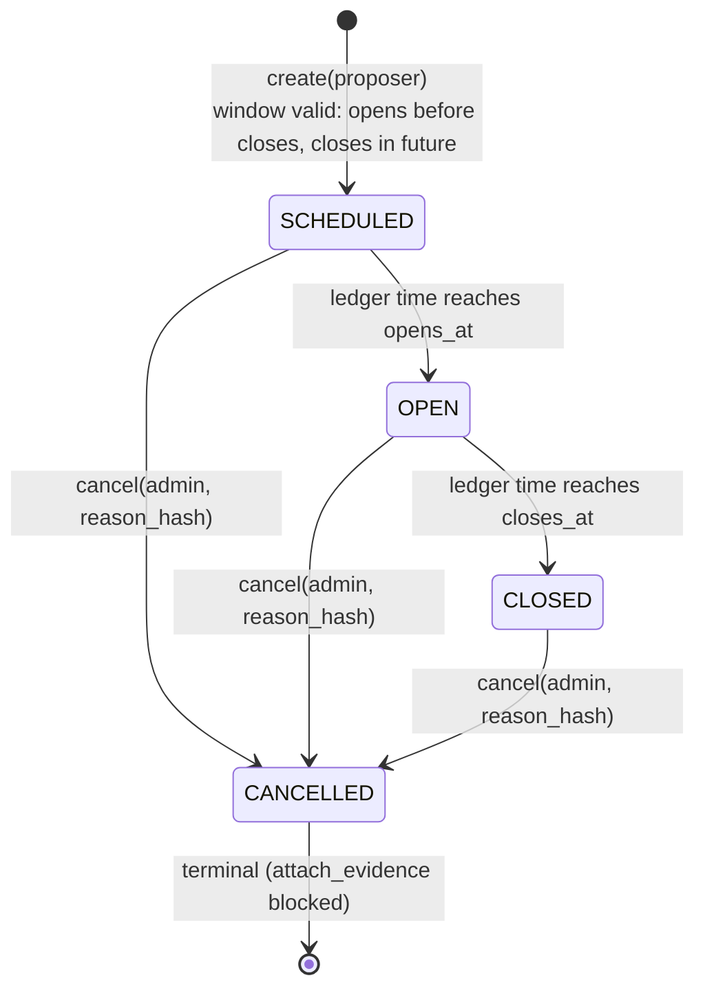
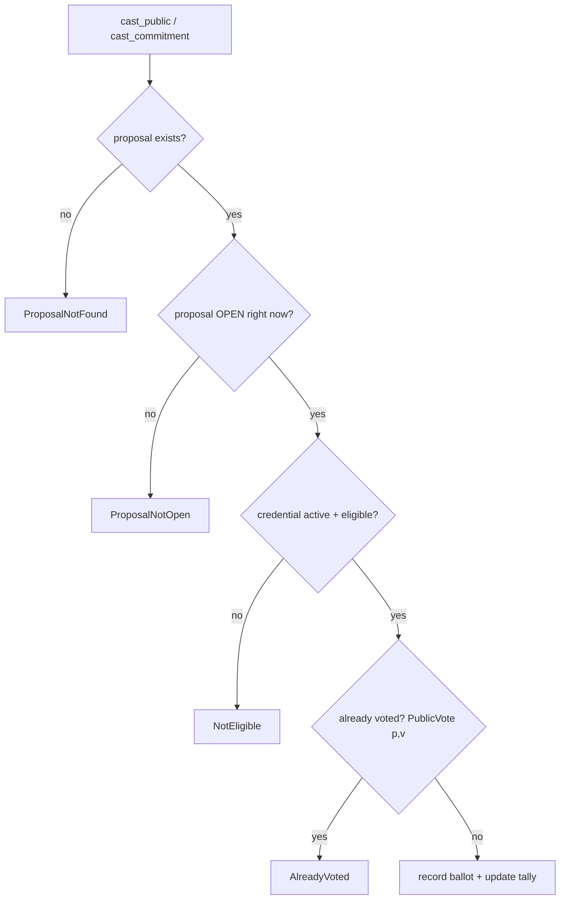
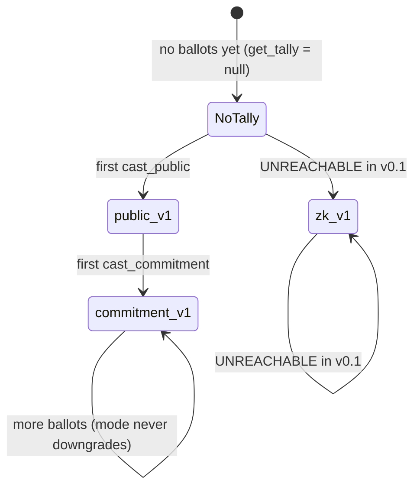
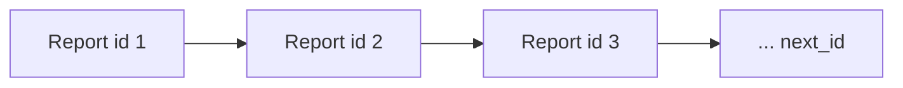

# Brújula Cívica state diagrams (v0.1)

Source of truth: contract code in `contracts/*/src/lib.rs`, proven by the named
tests in `contracts/*/src/test.rs` (28/28 green) and by live testnet evidence
(`deployments/*.json`).

Honesty rules used throughout (RFC BRUJULA-CIVICA-ARCH-001 §0/§1):

- On-chain status is **derived on every read**, never stored as mutable truth,
  whenever it is computable (proposal windows).
- Every transition below either succeeded on-chain in the evidence files or is
  proven by a named test; nothing is diagrammed "by design intent".
- States that **cannot occur in v0.1** are documented in §7 together with what
  the system shows instead — a missing state must degrade visibly (UNKNOWN),
  never silently into a positive claim.

---

## 1. Credential lifecycle — `brujula-identity` (RFC §3.1)

Stored record: `{subject, commitment, credential_type, status, eligible,
issued_at, updated_at}`. Only a 32-byte commitment — never raw identity data.



| Transition | Caller | Guard | Rejected with | Proven by |
|---|---|---|---|---|
| `[*] → ACTIVE` (`issue`) | admin | no credential yet; `eligible=true` at issue | `AlreadyIssued` | `issue_and_check_eligibility`, `issue_twice_fails` |
| `ACTIVE → SUSPENDED` | admin | status == ACTIVE | `InvalidTransition` | `suspend_reinstate_flow` |
| `SUSPENDED → ACTIVE` (`reinstate`) | admin | status == SUSPENDED | `InvalidTransition` | `suspend_reinstate_flow` |
| `* → REVOKED` (`revoke(subject, reason_hash)`) | admin | not already REVOKED (also forces `eligible=false`) | `InvalidTransition` | `suspend_reinstate_flow` ("revocation is final": double revoke and post-revoke reinstate both rejected) |
| `set_eligible(bool)` | admin | credential exists | `NotFound` | `set_eligible_flag` |

**Orthogonal flag, not a state:** `eligible` toggles independently of `status`.
The single downstream gate is `is_eligible(subject)` ⇔ `status == ACTIVE &&
eligible`. An unknown subject returns `false` — it never traps
(`unknown_subject_is_not_eligible`), so voters without credentials fail closed
as `NotEligible` instead of crashing the tally.

---

## 2. Proposal lifecycle — `brujula-proposal` (RFC §3.2)

Status is **not stored**; `compute_status` derives it on every read from
`cancelled` + ledger time:

```
status(id) = CANCELLED(3)  if cancelled
           = SCHEDULED(0)  if now <  opens_at
           = OPEN(1)       if now <  closes_at
           = CLOSED(2)     otherwise
```



| Fact | Behavior | Proven by |
|---|---|---|
| `create` window validation | `opens_at >= closes_at` or `closes_at <= now` → `InvalidWindow`; CID > 128 → `CidTooLong` | `invalid_windows_rejected`, `cid_length_enforced` |
| status derivation over time | SCHEDULED → OPEN → CLOSED | `create_and_derive_status` |
| `cancel` is terminal | second cancel → `AlreadyCancelled`; `attach_evidence` blocked afterwards | `cancel_is_terminal`, `attach_evidence_appends` |
| unknown id | `status()` traps `NotFound` (SDK surfaces `unknown`); `exists()`/`is_open()` return `false` without trapping (cross-contract safety) | `unknown_proposal_is_closed_not_found`, SDK `live.test.ts` |

---

## 3. Ballot acceptance gates — `brujula-vote` (RFC §3.3)



`cast_commitment` replaces the middle two gates with membership/nullifier
checks (it is commitment-addressed, not wallet-addressed):

| Gate | Rejected with | Notes |
|---|---|---|
| membership root set for proposal | `RootNotSet` | `set_membership_root` is admin-only |
| supplied root == stored root | `RootMismatch` | claim must match the admin-published set |
| nullifier unseen | `NullifierUsed` | one ballot per nullifier; value stored for audit |

Proven by: `public_vote_tallies_once_per_voter`, `double_public_vote_rejected`,
`voting_before_open_rejected`, `voting_after_close_rejected`,
`unknown_proposal_rejected`, `ineligible_voter_rejected`,
`commitment_requires_membership_root`, `commitment_wrong_root_rejected`,
`commitment_ballot_counts_with_honest_mode`, `duplicate_nullifier_rejected`,
`membership_root_is_admin_only`.

**Cross-contract wiring:** the vote contract reads `identity.is_eligible` and
`proposal.exists/is_open` through frozen minimal interfaces — it keeps no
shadow copy of eligibility or windows (`wiring_getters_expose_cross_contract_addresses`).

---

## 4. Tally `verification_mode` — monotonic strongest mode



- The contract writes only `public_v1` and `commitment_v1`
  (see the honesty note at the top of `brujula-vote/src/lib.rs`) — **no code path
  can produce a `zk_*` tally in v0.1**.
- No tally ⇒ `get_tally` returns `null` ⇒ off-chain verdict `unknown`, never a
  fabricated zero tally.
- Proven by: `commitment_ballot_counts_with_honest_mode`,
  `mixed_modes_tally_together`, SDK `live.test.ts`
  (`tally read … verdict unknown`).

---

## 5. Off-chain verdict — `@brugulacivica/sdk` verifier (6 checks)

Reads the tally from chain, then computes **all** of: `mode_recognized`,
`counts_well_formed`, `total_equals_sum_counts`, `total_equals_mode_split`,
`mode_consistent_with_split`, `votes_non_negative`.

| Verdict | Meaning |
|---|---|
| `verified` | every check `true` |
| `mismatch` | ≥ 1 check demonstrably `false` (tampering/corruption) |
| `unknown` | no tally, or a property cannot be proven (e.g. `zk_*` without a verified verifier) — **never reported as verified** |

The verdict rendered by the dashboard and embedded in
`deployments/smoke-test.json` comes from this verifier
(`scripts/tally-verdict.mjs`), never from a UI label. Unit-tested in
`packages/sdk/test/verifier.test.ts`; proven live in `test/live.test.ts`
and by the smoke test (`verdict: verified`, 6 checks, proposal 2).

---

## 6. Evidence chain — `brujula-accountability` (RFC §3.4)



- `anchor` is **append-only**: immutable `Report{proposal_id, report_hash,
  evidence_hash, kind, author, anchored_at}`, monotonic `next_id` starting at 1;
  there is no update or delete function.
- Anyone may anchor (author signs; tx fees rate-limit); `kind` is a free-form
  label — **the chain stores commitments, not conclusions**. Verifying that a
  report's *content* matches its hash is an **offline** operation against the
  published report/evidence set.
- Proven by: `anchor_and_read_back`, `append_only_sequence`, `admin_rotation`;
  live: `deployments/smoke-test.json` report ids 1–2 with anchor tx hashes.

---

## 7. Disabled / unreachable states in v0.1 (honesty table)

| State / feature | Why it cannot occur | What the system shows instead |
|---|---|---|
| `zk_*` tally mode | contract can only write `public_v1`/`commitment_v1` | verifier would return `unknown` for `zk_*` even if present; no UI badge can say "ZK verified" |
| Verified voting anonymity | no ZK verifier contract deployed (RFC §5 Phase 4) | `commitment_v1` ballots surface as **UNVERIFIED_COMMITMENT** — membership is claimed, not proven |
| Hermes analysis states | Hermes engine not implemented (out of MVP scope) | evidence rows are raw anchors + hashes only; no "AI audited" claims anywhere in the product |
| On-chain "report is true" | verification of report content is offline by design (RFC §3.4) | UI/verifier report anchor presence + hash match, never "report content verified on-chain" |
| IPFS content availability | v0.1 stores `content_cid` but does not pin content | dashboards read on-chain hashes; CID is provenance metadata, not a availability guarantee |
| Mainnet states | only `deployments/testnet.json` exists | every surface labels the network it read from |
| Credential statuses beyond 0/1/2 | enum is closed (`ACTIVE/SUSPENDED/REVOKED`) | any unknown numeric status → `unknown` envelope off-chain |

---

## 8. Where to see live state

- `deployments/testnet.json` — contracts, wasm hashes, deploy txs.
- `deployments/smoke-test.json` — full loop with `vote.vote_count`,
  `vote.verdict` (real verifier) and anchor txs for proposal 2.
- `deployments/testnet-neighbors.json` — 4 funded testnet identities
  (public addresses + Horizon-observed balances only).
- `node scripts/read-credential.mjs <G…>` / `node scripts/tally-verdict.mjs <id>`
  — read current state through the SDK (fail-closed JSON).
